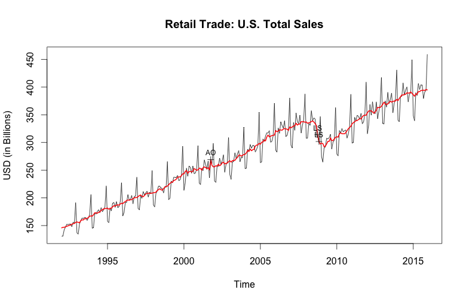

## Like peanut butter and jelly: x13binary and seasonal

_This post was written by [Dirk Eddelbuettel](http://dirk.eddelbuettel.com) and [Christoph Sax](http://www.christophsax.com/)
and posted by both author's respective blogs._

The [seasonal](https://cloud.r-project.org/package=seasonal) package by [Christoph Sax](http://www.christophsax.com/)
brings a very featureful and expressive interface for working with seasonal data to the [R](http://www.r-project.org)
environment. It uses the standard tool of the trade: [X-13ARIMA-SEATS](https://www.census.gov/srd/www/x13as/). This
powerful program is provided by the statisticians of the US Census Bureau based on their earlier work (named X-11 and
X-12-ARIMA) as well as the TRAMO/SEATS program by the Bank of Spain.
[X-13ARIMA-SEATS](https://www.census.gov/srd/www/x13as/) is probably the best known tool for de-seasonalization of
timeseries, and used by statistical offices around the world.

Sadly, it also has a steep learning curve. One interacts with a basic command-line tool which users have to download,
install and properly reference (by environment variables or related means). Each model specification has to be prepared
in a special 'spec' file that uses its own, cumbersome syntax.

As [seasonal](https://cloud.r-project.org/package=seasonal) provides all the required functionality to use
[X-13ARIMA-SEATS](https://www.census.gov/srd/www/x13as/) from R --- see the very nice
[seasonal demo](http://www.seasonal.website) site --- it still required the user to manually deal with the
[X-13ARIMA-SEATS](https://www.census.gov/srd/www/x13as/) installation.

So we decided to do something about this. A pair of [GitHub](http://github.com) repositories provide both the underlying
binary in a per-operating system form (see [x13prebuilt](https://github.com/x13org/x13prebuilt)) as well as a ready-to-
use R package (see [x13binary](https://github.com/x13org/x13binary)) which uses the former to provide binaries for R.  And the
latter is now on [CRAN](http://cran.r-project.org) as package [x13binary](https://cloud.r-project.org/package=x13binary)
ready to be used on Windows, OS-X or Linux. And the [seasonal](https://cloud.r-project.org/package=seasonal) package (in
version 1.2.0 -- now on CRAN -- or later) automatically makes use of it. Installing seasaonal _and_ x13binary in R is
now as easy as:


```r
install.packages("seasonal")
```

which opens the door for effortless deployment of powerful deasonalization. By default, the principal function of the 
package employs a number of automated techniques that work well in most circumstances. For example, the following code 
produces a seasonal adjustment of the latest data of US retail sales (by the Census Bureau) downloaded from 
[Quandl](http://www.quandl.com):

```r
library(seasonal) 

url <- "https://www.quandl.com/api/v3/datasets/USCENSUS/BI_MARTS_44000_SM.csv?order=asc"
rs <- ts(read.csv(url)$Value/1e3, start = c(1992, 1), frequency = 12)

m1 <- seas(rs)

plot(m1, main = "Retail Trade: U.S. Total Sales", ylab = "USD (in Billions)")
```

This tests for log-transformation, performs an automated ARIMA model search, applies outlier detection, tests and
adjusts for trading day and easter effects, and invokes the SEATS method to perform seasonal adjustment. And this is
how the adjusted series looks like:



Of course, you can access all available options of [X-13ARIMA-SEATS](https://www.census.gov/srd/www/x13as/) as
well. Here is an example where we adjust the latest data for Chinese exports (as tallied by the US FED), taking into
account the different effects of Chinese New Year before, during and after the holiday:


```r
url <- "https://www.quandl.com/api/v3/datasets/FRED/VALEXPCNM052N.csv?order=asc"
xp <- ts(read.csv(url)$VALUE/1e9, start = c(1981, 1), frequency = 12)

m2 <- seas(window(xp, start = 2000),
          xreg = cbind(genhol(cny, start = -7, end = -1, center = "calendar"), 
                       genhol(cny, start = 0, end = 7, center = "calendar"), 
                       genhol(cny, start = 8, end = 21, center = "calendar")
          ),
          regression.aictest = c("td", "user"),
          regression.usertype = "holiday")

plot(m2, main = "Goods, Value of Exports for China", ylab = "USD (in Billions)")
```

which generates the following chart demonstrating a recent flattening in export activity measured in USD.


We hope this simple examples illustrates both how powerful a tool `X-13ARIMA-SEATS` is, but also just how easy it is to
use [X-13ARIMA-SEATS](https://www.census.gov/srd/www/x13as/) from R now that we provide the
[x13binary](https://github.com/x13org/x13binary) package automating its installation.
