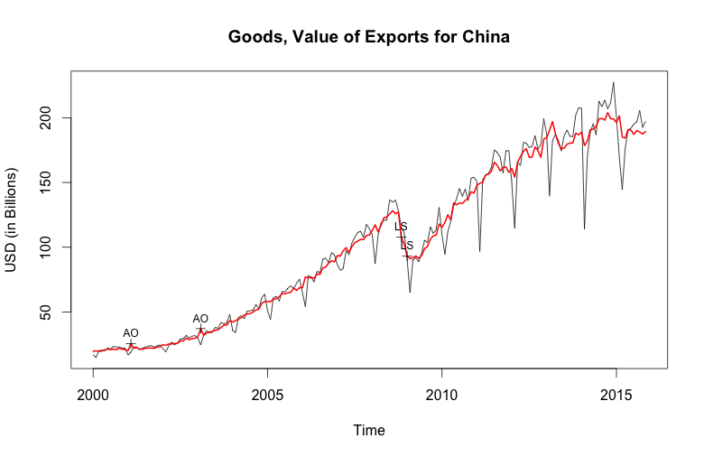

## Like peanut butter and jelly:  x13binary and seasonal

_This post was written by [Dirk Eddelbuettel](http://dirk.eddelbuettel.com) and [Christoph Sax](http://www.christophsax.com/)
and posted by both author's respective blogs.

The [seasonal](https://cloud.r-project.org/package=seasonal) package by [Christoph Sax](http://www.christophsax.com/)
brings a very featureful and expressive interface for working with seasonal data to the [R](http://www.r-project.org)
environment.  It uses the standard tool of the trade:  `X-13ARIMA-SEATS`. This program is provided by the statisticians of the
US Census bureau based on their earlier work (named X-11 and X-12) as well as the SEATS program by the Bank of
Spain. `X-13ARIMA-SEATS` is probably the best known tool for de-seasonalization of timeseries, and a standard. You can learn
more about it [at the official site](https://www.census.gov/srd/www/x13as/).

Sadly, it is also awkward to use.  While provided under a permissive license (which once again reminds us that there is
no upside to using non-standard licenses) and in source, nobody has created an API that can be called. All work
interacts with a basic command-line tool which users have to download, install and properly reference (by environment
variables or related means).

As the [seasonal](https://cloud.r-project.org/package=seasonal) provided all the required functionality to use
`X-13ARIMA-SEATS` from R --- see the very nice [seasonal demo](http://www.seasonal.website) site --- it still required
the user to manually deal with the `X-13ARIMA-SEATS` installation.

So we decided to do something about this. A pair of [GitHub](http://github.com) repositories provide both the underlying
binary in a per-operating system form (see [x13prebuilt](https://github.com/x13org/x13prebuilt)) as well as a ready-to-use R
package (see [x13binary](https://github.com/x13org/x13binary)) which uses the former to provide it for R.  And the latter is
now on [CRAN](http://cran.r-project.org) as package [x13binary](https://cloud.r-project.org/package=x13binary) ready to be
used on Windows, OS X, Linux or even Solaris.  And the [seasonal](https://cloud.r-project.org/package=seasonal) package (in
version 1.2.0 -- now on CRAN -- or later) automatically makes use of it.

So this opens the door for effortless deployment of powerful deasonalization.  Here is a simple example where we download
the value Chinese exports (as tallied by the US FED) from [Quandl](http://www.quandl.com) model it, taking into account the
Chinese New Year:

```r
library(seasonal) ## will get us access to X-13ARIMA-SEATS via x13binary
library(Quandl)   ## not needed but has some niceties, can deal with API key etc pp

xp <- Quandl(code="FRED/VALEXPCNM052N", type="ts")

m <- seas(window(xp/1e9, start = 2000),
          xreg = cbind(genhol(cny, start = -7, end = -1, center = "calendar"), 
                       genhol(cny, start = 0, end = 7, center = "calendar"), 
                       genhol(cny, start = 8, end = 21, center = "calendar")
          ),
          regression.aictest = c("td", "user"),
          regression.usertype = "holiday")

plot(m, ylab="USD (in Billions)")
```

which generates the following chart demonstrating a recent flattening in export activity measured in USD.



We hope this simple examples illustrates both how powerful a tool `X-13ARIMA-SEATS` is, but also just how easy it is to use
`X-13ARIMA-SEATS` from R now that we provide the [x13binary](https://github.com/x13org/x13binary) package automating its
installation. 
